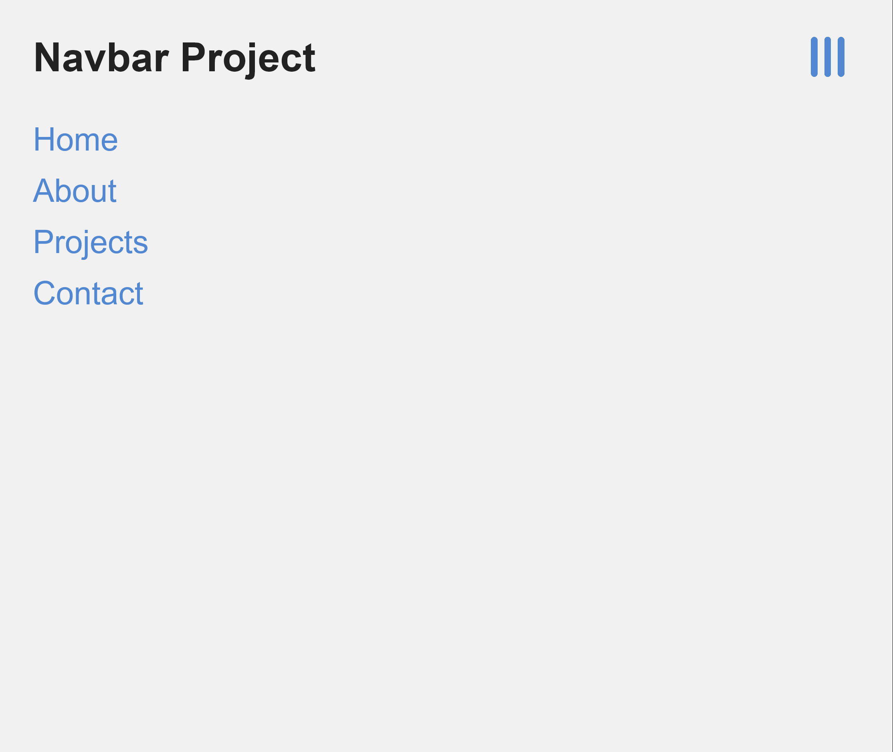

# javascript-navbar
A navbar is used by almost every website. I created this simple one in Javascript in order to learn how to do it.
The hamburger menu images also changes, but i didn't figure out how to make animations yet.
This took me 16 lines of code if you don't include the comments.

## Preview

